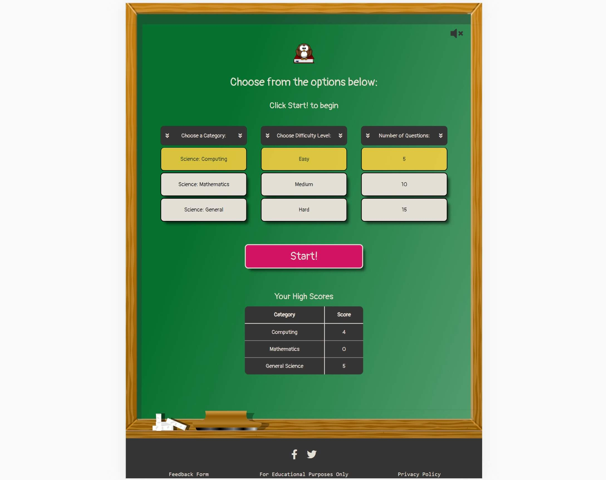
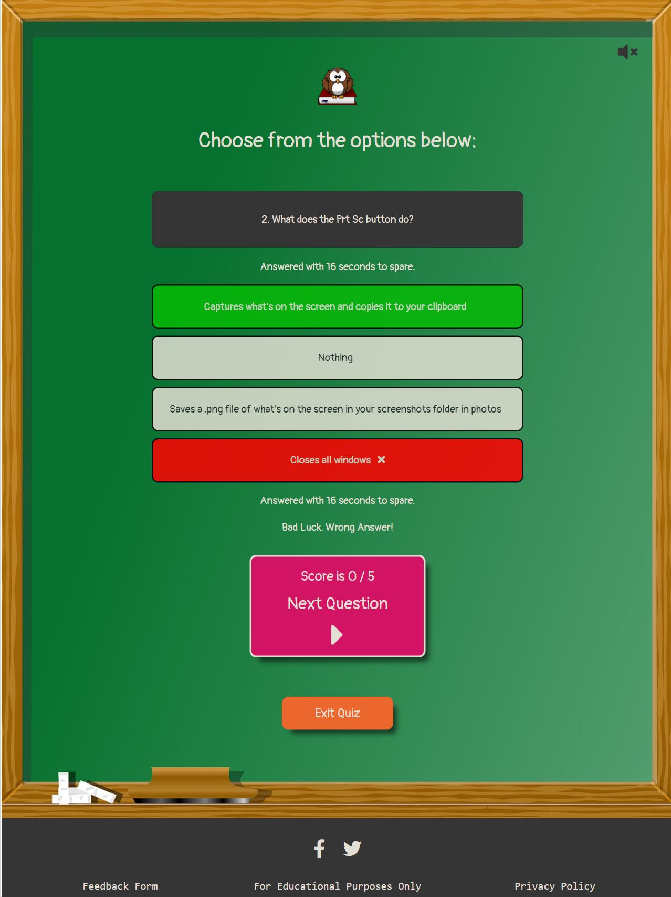
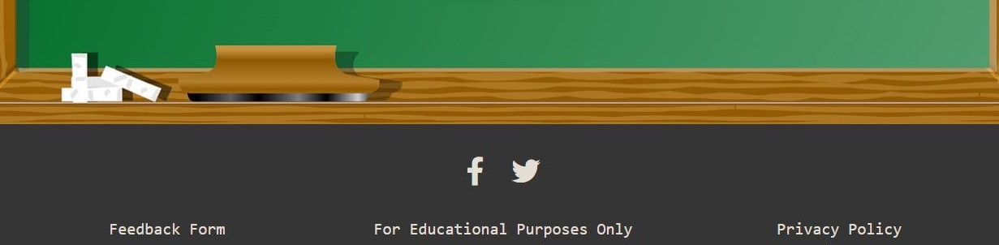
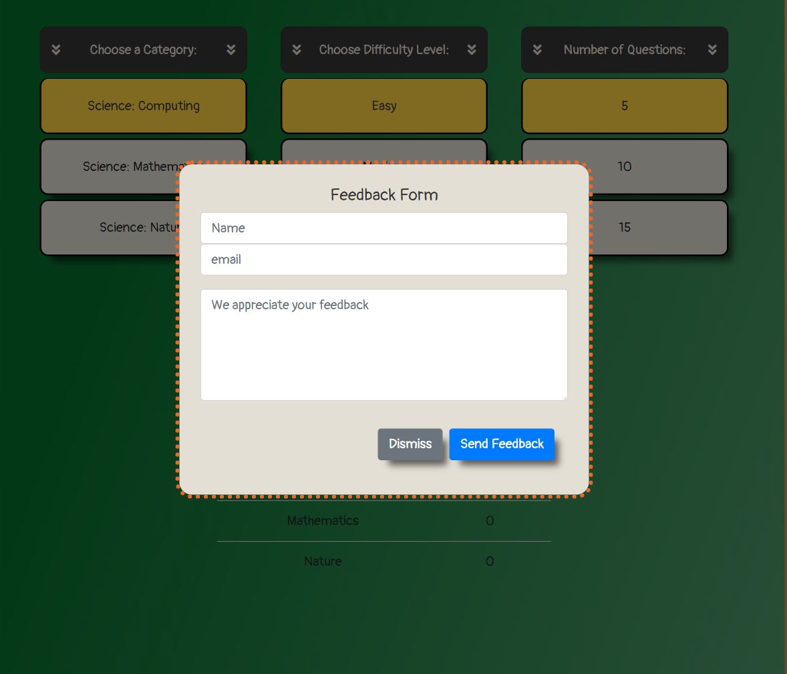
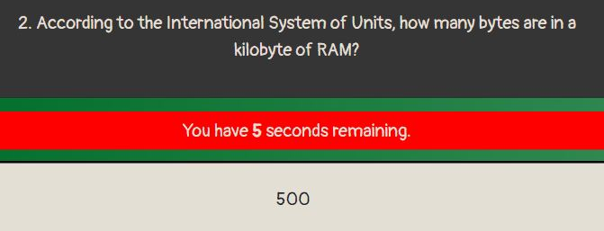
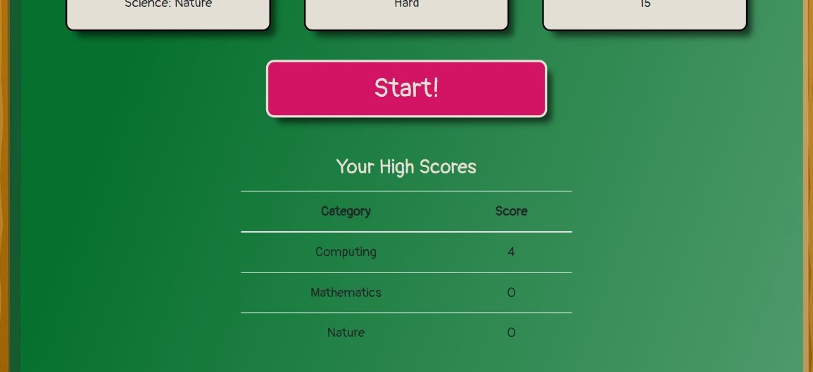
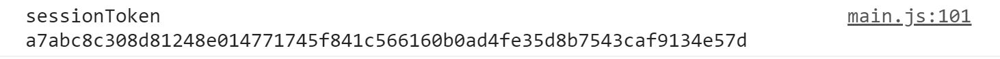
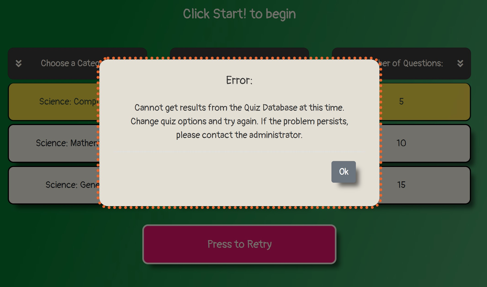
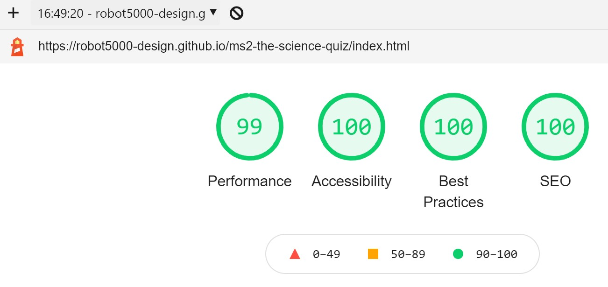
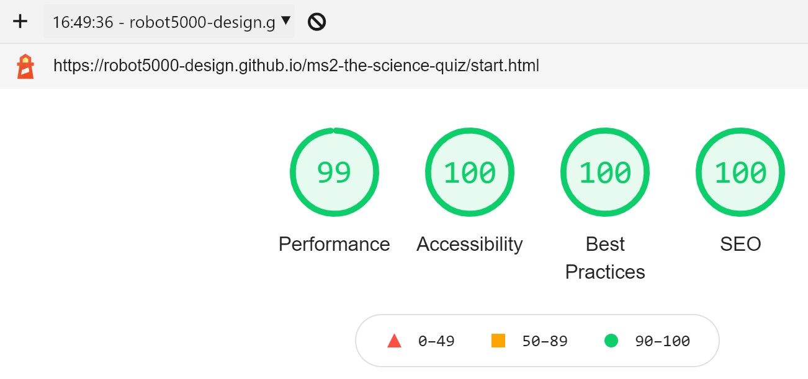

# The Science Quiz

## 2nd Milestone Project

## Interactive Front-End Development

## Code Institute 2020

---

The brief for this project was to build an interactive website application using HTML, CSS and
JavaScript. The author chose to develop a quiz game as the subject, obtaining quiz data from the
Opentdb.com quiz API. The design is based on user experience principles. Clean coding and a responsive
mobile first method was employed. The purpose of this website is to provide users with:

- a useful, fun and appealing test for students, academics or anybody else who has an interest in
computing, maths or general science.
- multiple science categories.
- varying difficulties.
- a question countdown timer.
- a high score table.
- feedback as to the correct answer.
- an easy and smooth to operate interface.

---

### See the image below for an example of the responsiveness of the site.

Click the image to be taken to a live demo of the site:

[![homepage][1]][2]

[1]: ./documentation/images-for-readme/am-i-responsive.jpg
[2]: https://robot5000-design.github.io/ms2-the-science-quiz/index.html "Live Site"

---

### **Contents:**

[1. UX Design](#1-ux-design)

[2. Features and Functionality](#2-features-and-functionality)

[3. Technologies Used](#3-technologies-used)

[4. Testing](#4a-testing-part-1)

[5. Deployment](#5-deployment)

[6. Credits and Notes](#6-credits-and-notes)

---

### **1. UX Design**

#### Strategy

_User Stories:_

There are 2 types of users of the site: the site owner or all other users which include students, 
academics etc. The 2nd group have a common set of user goals.

As the site owner:

- I want the site to be fun and appealing to use.
- I want the site to look visually appealing.
- I want the site to provoke a positive response.
- I want the site to be easy and natural to use with smooth navigation between sections.
- I want the site to not only tell the user if they got a question wrong but also to tell them the 
correct answer.
- I want the site to be a learning tool.
- I want users to be able to offer feedback to the site, maybe new questions.
- I want users to be able to see updates or news on the site through social media links.
- I want a countdown timer to make the quiz more exciting.
- I want sound effects to reward the user and to offer feedback.
- I want a high score table saved from session to session.
- I want to avoid repetition of questions to a user.
- I want the site to have significant interactivity.
- I want the site to deal with potential errors without breaking the site or affecting the user 
negatively.
- I want the functionality to be as automated as possible but I want the user to be able to move 
between qustions themselves so that they can take in the answers at their own pace.

As a user:
- I want the site to be fun and appealing to use.
- I want the site to look visually appealing.
- I want the site to be easy to use with smooth navigation between sections.
- I want to learn something from using the site.
- I want to be able to offer feedback and suggest new questions.
- I want to be aware of updates or new features.
- I want the site to have a good variety of questions without continuous repetition.
- Sounds effects feedback would be useful.
- I want to be able to keep track of my best scores.
- I want to be able to choose a difficulty level i can manage and vary the quiz length depending on 
how much time I have.
- I want a site that is not commonly crashing with errors, or if there is an error it is managed 
properly.

From researching other online quizzes, most are quite similar in presentation. Some have timers, but
others do not. Most offer points scoring which helps to keep them addictive. Most do not offer any 
kind of difficulty level option which is not good for user retention if the user cannot find a level
which suits them. Some offer the option of a hint but because the free API that is being used for 
this project does not have that option, this project will not have that particular feature.
[Opentdb](https://opentdb.com/) Quiz API was used for this project because of the choice of topics,
it's free to use and appears to be reliable.

#### Scope

Based on the results of the Strategy research the features to be included are:

- A Landing page which offers a brief explanation and introduction to the site and the reason for its
existence.
- An Options page, where the user chooses topic, difficulty level and quantity of questions.
- The Questions/answers page should show 4 answers for multiple choice and 2 answers for boolean
questions. It should have a submit and next-question button and a reset quiz button.
- Use buttons, if possible rather than dropdowns or tickboxes for a better user experience.
- A Modal containing a Feedback form.
- Social Links, e.g. Facebook, Twitter.
- A countdown timer if possible.
- Shows Correct Answer Feedback.
- Display the current high score.
- Sound effects and a button to mute them.
- Use a free quiz API.
- Use the available API Token which ensure questions are not repeated during a session.

From the Strategy Table and graph it was clear that all features considered important are probably 
viable.

#### Structure

- A simple structure with just 2 pages, the introduction/landing page and the quiz page.
- On the Quiz page, hide the quiz options and show the questions using javascript or vice versa.
- Custom 404 page, so in the case of a broken internal link a button is provided for the user to return
to safety. Unlikely to be required but included nevertheless.

#### Skeleton

Wireframes made in Balsamiq Wireframes were used for basic layout. These can be viewed here:

[Landing Page All Sizes](./documentation/wireframes/landing-page-all-sizes.png)

[Options Page All Sizes](./documentation/wireframes/options-page-all-sizes.png)

[Questions Page All Sizes](./documentation/wireframes/questions-page-all-sizes.png)

#### Surface

It was decided to use a green chalkboard themed background to suit the science theme of the site.
[Pixabay](https://pixabay.com/) provided the free background image and the owl icon.

The main background colour is courtesy of the background image and the median colour is green #306821. 
Text colour is an off-white #E4DFD5 which contrasts well with the green background colour and a charcoal
colour #353535 was used for the footer. The main CTA buttons are an eye-catching pink #D31363.
The combination of colours provide contrast ratios that allow the site to score 100% in the Accessibility 
category on Chrome Development Tools Lighthouse.
A single font was chosen, Pangolin from Google Fonts. This was chosen for its imperfect appearance so
that text could look like it's handwritten.

![ColourChoices][3]

[3]: ./documentation/images-for-readme/coolors-palette.png "Colour Choices"

---

### **2. Features and Functionality**

The site was designed with a mobile first approach. Customised Bootstrap was used to help with the 
responsiveness and layout of the site. In addition targeted media queries were used to assist with this.
There are sound effects but the site is muted by default. There is a button in the top right corner to
unmute. The background image was split into 3 parts, top, middle and bottom. By doing this the middle
image can stretch to the height of the content on screen, without distortion of the top and bottom of 
the image due to the stretching. The bottom image which contains a duster and chalk can stretch wide or
narrow without looking odd, so it works equally well on desktops or mobile.

_Landing page:_

The landing page features a simple message as the users focus falls to a black box which contains an
explanation of what the site does. A large obvious CTA with the text Go! signifies to the user what 
to do next. Font Awesome icons are used throughout the site, where appropriate to help guide the user.

_Quiz Options:_

Box shadows have been placed under all the buttons to give them a 3D effect and the illusion of lifting 
them off the page. When a button is pressed the shadow disappears. This is most evident on the quiz 
options page when cycling through the options. There are three sets of buttons: for the category, the 
difficulty level and the number of questions. Below them is a large CTA which says Start! which acts as
an obvious indicator to the user, of what to do next.

Below the options is a high scores table which contains the highest score the user has acheived in each 
category. This information is saved as an object to local storage and checked for existence every time 
the page is loaded. It is updated after each quiz round. Also when the page is loaded a new instance of 
the Quiz Class is created. The Quiz Class contains all the variables associated with a game of the quiz.
An added benefit is that it helps to reduce the number of variables in the global space.

When the Start! button is pressed, some asynchronous tasks are performed. A loading spinner is displayed
in the Start button to alert the user that something is happening while the quiz data is being retrieved
from the Opentdb Quiz API.
First the program checks if a token exists already. The token ensures that question repetition does not 
occur during a session. This will have been retrieved from session storage on page load. If it does not 
exist the getToken function is run, which returns a Promise to get a new token through a new XMLHttpRequest.
If this resolves successfully, the getQuizData function is run. This function is a new XMLHttpRequest,
using the main quiz API URL with the token appended. If data is returned it is passed to the checkToken
function for validation. If the token is found to be invalid, expired (expires after 6 hours of inactivity),
or exhausted (all questions for that topic have been presented), the main API returns different response
codes. The checkToken function handles these. If the token is invalid or expired, a new token is requested,
or if it is exhausted the token can be reset using a specific reset token URL.

If there is a problem obtaining a token from the API, a modal message is displayed to the user informing them of
the error and that they can try again. Likewise, if there is a problem with the readyState or status of 
either of the XMLHttpRequests, a modal message is displayed to the user informing them of the error and that 
they can try again. By way of validating the JSON data returned by the XMLHttpRequest, if there is a JSON 
parsing error, the error is caught and alerted to the user by modal, with the option to try again.
Finally, even if the token response is ok (response code 0), the data is validated again to ensure the response 
actually includes a set of questions, by checking if the array is empty.

_Quiz Questions and Answers:_

When the token checks ok, the askQuestions function is run which hides the quiz options and presents 
the question/answers to the screen. The header element with owl icon is removed for screen heights lower
than 1000 pixels, to provide for a better user experience on smaller screens. Also, pointer events are set
to none for the owl icon during a game, to avoid unintentional clicks. In addition, the window 
scrolls so that the question appears at the top of the page. Questions can be either multiple choice, or
boolean. Multiple choice questions should have four possible answers. Boolean questions have two, so when
a boolean question is presented, the extra unused answer buttons are hidden from the user.
In addition to that, the JSON answers quantity is validated to ensure there is no more than 3 incorrect 
answers to each question. If the array of answers is greater than 3, the shuffleAnswers function pops the
extra unnecessary answers.

Answers are presented as buttons on screen. When the user selects an answer the button appears to be
pushed as the box-shadow is removed. After a timeout, the correct answer is informed to the user by 
lighting up green, while the incorrect answer lights up red. After another timeout, all answer buttons shadows
are removed indicating that they can no longer be pressed, while the shadow is then applied to the 
Next Question button signifying it is now live. To help reinforce to the user what can and can't be pressed,
cursor: not-allowed is used, which gives additional visual representation (except for the options buttons, as
it works better for keyboard-only users).

The countdown timer is shown both above and below the answers and it lights up red when there is 5 
seconds left. This really catches the users' peripheral vision. If the timer times out, all answer button
shadows are removed and this visual and text signify to the user that time is up.

For a better user experience, for multiple choice questions on screens of less available height
than 750px, after a timeout the window scrolls down to show the Next Question button. The only available
buttons with shadows, are the Next Question or Exit Quiz buttons.

Originally there were separate Submit and Next buttons, but it was decided that a better user experience
would be achieved by removing the Submit button. Answer selection and submit now happen as one. When the quiz
gets to the last question the Exit Quiz button is hidden and the Next Question text is changed to Finish Quiz 
and the button colour is changed to the same colour as the Exit Quiz button (which is now hidden). When the 
Finish Quiz button is pressed a modal showing information on the score achieved is shown.

Media Queries are used to reduce the width of the question/answers container as the screen width increases,
so it keeps visually better proportions.

Common to both pages is a constant footer which contains links to social media and privacy (doesn't 
exist). These links provide interactive feedback, when hovered over they change colour. They open in
a new tab. The footer also contains a link for providing feedback to the site admin. This is implemented
using a modified bootstrap modal which uses the [Emailjs](https://www.emailjs.com/) service and some 
custom javascript in the [email.js](./assets/js/email.js) file. If feedback is provided the service
returns an acknowledgement email to the sender and forwards the message to the admin. All entries to
the modal are required. The modal can only be dismissed via the modal buttons so the user cannot be 
trapped on a screen with potentially disabled buttons.

The same modal is used for feedback, quiz exit, final score and error messages.

_Custom 404 page:_

This is activated if there was a broken internal link or if a user manually tries to type or modify an
internal address.

_Other potential features which could be implemented in future:_

- the landing page could contain wigets to different themed sites covering other topics. Most of the 
existing code would be repeated.

These would allow the website to have updates which could keep some users coming back.

- it may be useful to add a helpful warning if a user tries to leave the page using the browser
navigation buttons, which could be unfortunate in the middle of a high score game.

- a share option, to allow users to share interesting questions via common social channels.

---

### **3. Technologies Used**

_IDE and Languages:_

- Gitpod - IDE used.
- HTML - Base structural language.
- CSS - Language used for styling.
- JavaScript - for application functionality and DOM manipulation.

_Libraries & frameworks:_

- jQuery 3.5.1 - used to speed up selection of elements in javascript.
- Bootstrap 4.5.2 - Used to help with grid layout and screen size responsiveness.
- JavaScript, Popper.js, and jQuery as part of Bootstrap.
- Font Awesome for icons.
- Google Fonts for Pangolin font.

_API's:_

- Opentdb - Quiz API
- Emailjs - For feedback email service.

_Hosting and Version Control:_

- GitHub - Holding repository and hosting site.
- Git - Version control.

_Others:_

- JSDoc for JavaScript documentation.
- Balsamiq - For wireframes.
- Microsoft Paint 3D - For editing images.
- HTML-CSS-JS.com - For box-shadow editing.
- Browserstack - To check base compatibility.
- freeformatter.com - to format html files.
- tinyjpg.com - to reduce image file size.
- Autoprefixer - used to automatically add browser compatibility prefixes.
- w3c - for HTML and CSS validation.
- jshint - for JavaScript validation.
- bearaudiotool - for sound effects editing.

As per industry practice and to reduce the number of small commits on the master branch, seperate 
branches were created and used for features (where appropriate) and for the readme file as they were
developed. These were squashed, merged and deleted after use.

JSDoc was used to generate documentation on the JavaScript file functions. The procedure is as follows:

To install JSDoc globally run the following command in the terminal:

- npm install -g jsdoc

To generate documentation run the following command in the terminal:

- jsdoc ./assets/js/main.js ./assets/js/email.js

The documentation is saved in a folder named _out_ by default and a webpage is generated which contains
information on all classes and functions. The JavaScript code was broken into smaller functions where 
possible or where deemed to be useful, to make for easier reading and future refactoring. Even so, given
more time there is room for further optimisation in this area.
[Link to JSDoc documentation webpage.](https://robot5000-design.github.io/ms2-the-science-quiz/out/index.html)

---

### **4a. Testing Part 1**

The first part of testing was to confirm that all user stories requirements have been met. There is 
large crossover between both sets of user stories.

For the site owner:
- I want the site to be fun and appealing to use.
- I want the site to look visually appealing.
- I want the site to provoke a positive response.
- I want the site to be easy and natural to use with smooth navigation between sections.
- I want the site to have significant interactivity.

For a user:
- I want the site to be fun and appealing to use.
- I want the site to look visually appealing.
- I want the site to be easy to use with smooth navigation between sections.
- I want to be able to choose a difficulty level I can manage and vary the quiz length depending on 
how much time I have.

_This has been achieved by the overall theme and the liberal use of buttons for every function. The 
strategic use of shadows and colours indicates to the user what they can and can't operate at any given
moment. The options menu allows the user to set difficulty level and quantity of questions._

For the site owner:
- I want the site to not only tell the user if they got a question wrong but also to tell them the correct
answer.
- I want the site to be a learning tool.
- I want the functionality to be as automated as possible but I want the user to be able to move between
qustions themselves so that they can take in the answers at their own pace.

For a user:
- I want to learn something from using the site.

_This has been achieved by not just telling the user if they got the question wrong but by also informing
them of the correct answer and allowing them to continue to the next question when they are ready. 
Therefore allowing the user to properly process the answer._

For the site owner:
- I want users to be able to offer feedback to the site, maybe new questions.
- I want users to be able to see updates or news on the site through social media links.

For a user:
- I want to be able to offer feedback and suggest new questions.
- I want to be aware of updates or new features.

_This has been achieved by providing social media links in the footer and a feedback form in a modal 
which forwards the information to the admin and returns an acknowledgement email to the user. All inputs
of the form are required._

For the site owner:
- I want a countdown timer to make the quiz more exciting.

_This has been achieved by having a countdown timer._

For the site owner:
- I want sound effects to reward the user and to offer feedback.

For a user:
- Sounds effects feedback would be useful.

_This has been achieved by providing sound effects which are muted by default. A button is provided in 
the top right corner to un-mute._

For the site owner:
- I want a high score table saved from session to session.

For a user:
- I want to be able to keep track of my best scores.

_This has been achieved by providing a high score table which is saved to local storage._

For the site owner:
- I want to avoid repetition of questions to a user.

For a user:
- I want the site to have a good variety of questions without continuous repetition.

_This has been achieved by making use of the opentdb API token, which ensures that questions are not
repeated during a session. The token is saved to session storage. This is explained in more detail in
the features section above. However, even with the token some options configurations will only have a
certain quantity of questions available in the quiz API._

For the site owner:
- I want the site to deal with potential errors without breaking the site or affecting the user negatively.

For a user:
- I want a site that is not commonly crashing with errors, or if there is an error it is managed properly.

_This has been achieved by handling errors when they occur requesting data from the API URL or the token
URL and handling JSON parsing errors by displaying a message modal to the user so they can try again. Some basic 
data validation on the JSON data is carried out. There's more detail on this in the 
[2. Features and Functionality](#2-features-and-functionality) section above._

---

### **4b. Testing Part 2**

The site has been tested on both mobile and desktop for responsiveness. Only manual testing was
conducted for this project.

Any issues have been cataloged in the Issues section on Github and closed when a sufficient solution
was reached. Prior to final testing of the live site, functional testing was carried out using judiciously 
placed console logs before they were removed. These are saved in a separate file [here](./documentation/manual-test-ref.md)
and are included only for reference. There are no known exisiting issues with the final deployed version.

__Final testing of links, responsiveness and Live Website test cases can be found in the [final testing document here](./documentation/final-testing.md).__

All HTML and CSS files have been passed through the w3c validation service https://validator.w3.org/ 
with no significant issues. It advised not to use aria-disabled on disabled buttons. These were removed.

Javascript files were passed through jshint.com without any significant issues. Jshint suggested using
dot notation rather than square brackets, accessing the highscore object, so this has been changed.

__Chrome Dev Tools Lighthouse made some suggestions:__

- size of images was reducing performance. All images have been reduced in size.

- The emaijs javascript scripts were moved to the bottom of the body and minified and/or slim versions 
of jQuery and Bootstrap used to improve loading performance.

- form inputs had no label. This is for styling reasons with only placeholder text present. An appropriate
aria-label has been added to each form input for assistive technology as suggested here 
(https://www.w3.org/WAI/tutorials/forms/labels/#hidden).

- pages did not have a meta description for search engine optimisation. This has now been added.

_The Chrome Dev Tools Lighthouse scores are now as follows:_

- Index Page:

- Quiz Page:

All links both internal and external have been tested and verified from each page in turn. External links
open in a new tab. As stated previously the privacy link is not directed to any address.

As was pointed out on the Code Institute Slack community and by my mentor the 404 page has limited 
functionality. It is only for broken internal links of which there are none. However, it can be tested
by modifying the web address to be incorrect in the browser address bar. Note that if a forward slash
is added to the end of the address the 404 page appears unstyled. Thanks again to the Slack community
for pointing this out.

---

### **5. Deployment**

The site has been deployed on Github pages 
[here](https://robot5000-design.github.io/ms2-the-science-quiz/index.html).

_To Deploy on Github Pages:_

1. On GitHub, navigate to Settings in the GitHub repository.
2. Scroll down to the GitHub Pages section.
3. Under Source, select the Master branch.
4. Press Save.
5. After it saves, scroll back down to the GitHub Pages section and the URL for
where the site is published will now be available.

_For this website to be run locally it can downloaded as a ZIP file or it can be cloned:_

- To download and run a local ZIP copy:

1. On GitHub, navigate to the main page of the repository.
2. Above the list of files, click Code.
3. Click Download ZIP.
4. Navigate to the local Downloads folder and un-zip the project_one-master folder.
5. Open the file index.html in an internet browser.

- To Clone using Command Line:

1. On GitHub, navigate to the main page of the repository.
2. Above the list of files, click Code.
3. To clone the repository using HTTPS, under "Clone with HTTPS", copy the URL.
To clone the repository using an SSH key, including a certificate issued by your organization's
SSH certificate authority, click Use SSH, then copy the URL.
4. Open Git Bash.
5. Change the current working directory to the location where you want the cloned directory.
6. Type git clone, and then paste the URL you copied earlier: \$ git clone url-copied-earlier
7. Press Enter to create your local clone.

- To Clone using GitHub Desktop:

1. On GitHub, navigate to the main page of the repository.
2. Above the list of files, click Code.
3. Click "Open with GitHub Desktop" to clone and open the repository with GitHub Desktop.
4. Follow the prompts in GitHub Desktop to complete the clone.

---

### **6. Credits and Notes**

- All code in this project is completely the authors unless otherwise indicated in the code.

- Quiz data API is supplied by https://opentdb.com/.

- All images are from pixabay.com and are free to use without attribution.

- All sound effects are from https://mixkit.co/ and are free to use without attribution.

- Information on deployment was taken from Github Documentation
[here](https://docs.github.com/en/github/creating-cloning-and-archiving-repositories/cloning-a-repository).

- The Code Institute Slack community for information regarding the imlementation of the 404 page.

- My Mentor for their time and advice.

- Friends and family who tested the site.

---

### **Disclaimer**

- This website is for educational purposes only.