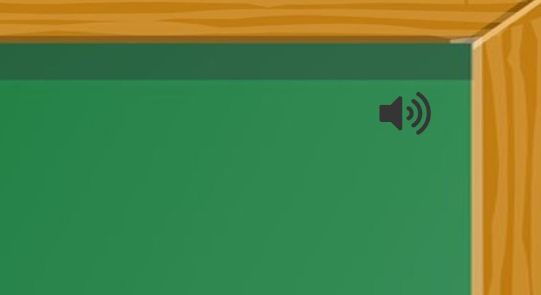
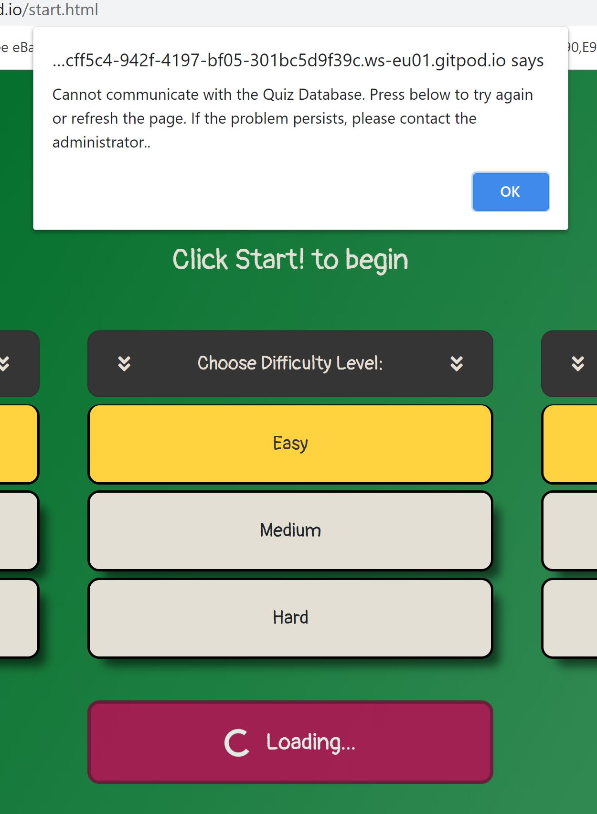

# The Science Quiz

## 2nd Milestone Project

## Interactive Front-End Development

## Code Institute 2020

---

The brief for this project was to build an interactive website application using HTML, CSS and JavaScript. The author chose to develop a quiz game as the subject. The design is based on user experience priciples. Clean coding and a responsive mobile first method was employed. The purpose of this website is to provide users with:

- a useful fun and appealing test for students, academics or anybody else who has an   interest in computing, maths or nature science.
- multiple science categories.
- varying difficulties.
- a question countdown timer.
- a high score table.
- feedback as to the correct answer.
- an easy and smooth to operate interface.

---

### See the image below for an example of the responsiveness of the site.

Click the image to be taken to a live demo of the site:

[![homepage][1]][2]

[1]: ./documentation/images-for-readme/am-i-responsive.JPG
[2]: https://robot5000-design.github.io/ms2-the-science-quiz/index.html "Live Site"

---

### **Contents:**

[1. UX Design](#1-ux-design)

[2. Features and Functionality](#2-features-and-functionality)

[3. Technologies Used](#3-technologies-used)

[4. Testing](#4a-testing-part-1)

[5. Deployment](#5-deployment)

[6. Credits](#6-credits)

---

### **1. UX Design**

#### Strategy

_User Stories:_

There are 2 types of users of the site: the site owner or all other users which include students, academics etc. The 2nd group have a common set of user goals.

As the site owner:

- I want the site to be fun and appealing to use.
- I want the site to look visually appealing.
- I want the site to provoke a positive response.
- I want the site to be easy and natural to use with smooth navigation between sections.
- I want the site to not only tell the user if they got a question wrong but also to tell them the correct answer.
- I want the site to be a learning tool.
- I want users to be able to offer feedback to the site, maybe new questions.
- I want users to be able to see updates or news on the site through social media links.
- I want a countdown timer to make the quiz more exciting.
- I want sound effects to reward the user and to offer feedback.
- I want a high score table saved from session to session.
- I want to avoid repetition of questions to a user.
- I want the site to have significant interactivity.
- I want the site to deal with potential errors without breaking the site or affecting the user negatively.
- I want the functionality to be as automated as possible but I want the user to be able to move between qustions themselves so that they can take in the answers at their own pace.

As a user:
- I want the site to be fun and appealing to use.
- I want the site to look visually appealing.
- I want the site to be easy to use with smooth navigation between sections.
- I want to learn something from using the site.
- I want to be able to offer feedback and suggest new questions.
- I want to be aware of updates or new features.
- I want the site to have a good variety of questions without continuous repetition.
- Sounds effects feedback would be useful.
- I want to be able to keep track of my best scores.
- I want to be able to choose a difficulty level i can manage and vary the quiz length depending on how much time i have.
- I want a site that is not commonly crashing with errors, or if there is an error it is managed properly.

From researching other online quizzes, most are quite similar in presentation. Some have timers, but others do not. Most offer points scoring which helps to keep them addictive. Most do not offer any kind of difficulty level option which is not good for user retention if the user cannot find a level which suits them. Some offer the option of a hint but because the free API that is being used for this project does not have that option, this project will not have that particular feature. [Opentdb](https://opentdb.com/) Quiz API was used for this project because of the choice of topics, it's free to use and appears to be reliable.

#### Scope

Based on the results of the Strategy research the features to be included are:

- A Landing page which offers a brief explanation and introduction to the site and the reason for its existence.
- An Options page, where the user chooses topic, difficulty level and quantity of questions.
- The Questions/answers page should show 4 answers for multiple choice and 2 answers for boolean questions. It should have a submit and next-question button and a reset quiz button.
- Use buttons if possible rather than dropdowns or tickboxes for a better user experience.
- A Modal containing a Feedback form.
- Social Links, eg. facebook, twitter.
- A countdown timer if possible.
- Shows Correct Answer Feedback.
- Display the current high score.
- Sound effects and a button to mute them.
- Use a free quiz API.
- Use the available API Token which ensure questions are not repeated during a session.

From the Strategy Table and graph it was clear that all features considered important are probably viable.

#### Structure

- A simple structure with just 2 pages, the introduction/landing page and the quiz page.
- On the Quiz page, hide the quiz options and show the questions using javascript or vice versa.
- Custom 404 page, so in the case of a broken internal link a button is provided for the user to return to safety. Unlikely to be requred but included nevertheless.

#### Skeleton

Wireframes made in Balsamiq Wireframes were used for basic layout. These can be viewed here:

[Landing Page All Sizes](./documentation/wireframes/landing-page-all-sizes.png)

[Options Page All Sizes](./documentation/wireframes/options-page-all-sizes.png)

[Questions Page All Sizes](./documentation/wireframes/questions-page-all-sizes.png)

#### Surface

It was decided to use a green chalkboard themed background to suit the science theme of the site.
[Pixabay](https://pixabay.com/) provided the free background image and the owl icon.

The main background colour is courtesy of the background image and the median colour is green #306821. Text colour is an off-white #E4DFD5 which contrasts well with the green  background colour and a charcoal colour #353535 was used for the footer. The main CTA buttons are an eye catching pink #D31363.
The combination of colours provide contrast ratios that allow the site to score 100% in the Accessibility category on Chrome Development Tools Lighthouse.
A single font was chosen, Pangolin from Google Fonts. This was chosen for its imperfect appearance so that it could be handwritten.
 

![ColourChoices][3]

[3]: ./documentation/images-for-readme/coolors-palette.png "Colour Choices"

---

### **2. Features and Functionality**

The site was designed with a mobile first approach. Customised Bootstrap was used to help with the responsiveness and layout of the site. In addition targeted media queries were used to assist with this. There are sound effects but the site is muted by default. There is a button in the top right corner to unmute. The background image was split into 3 parts, top, middle and bottom. By doing this the middle image can stretch to the height of the content on screen without distortion of the top and bottom of the image due to the stretching.

_Landing page:_

The landing page features a simple message as the users focus falls to a black box which contains an explanation of what the site does. A large obvious CTA with the text Go! signifies to the user what to do next.

_Quiz Options:_

Box shadows have been placed under all the buttons to give them a 3D effect and the illusion of lifting them off the page. When a button is pressed the shadow disappears. This is most evident on the quiz options page when cycling through the options. There are three sets of buttons: for the category, the difficulty level and the number of questions. Below them is a large CTA which says Start! which acts as an obvious indicator to the user, what to do next.

Below the options is a high scores table which contains the highest score the user has acheived in each category. This information is saved as an object to local storage and checked for existence every time the page is loaded. It is updated after each quiz round.

When the Start! button is pressed, some asynchronous tasks are performed. A loading spinner is displayed in the Start button to alert the user that something is happening while the quiz data is being retrieved.
First the program checks if a token exists already. The token ensures that question repetition does not occur during a session. This will have been retrieved from session storage on page load. If it does not exist the getToken function is run, which returns a promise to get a new token through a new XMLHttpRequest. If this resolves successfully the getQuizData function is run. This function is a new XMLHttpRequest using the main quiz API URL with the token appended. If the token is found to be invalid, expired (expires after 6 hours of inactivity) or exhausted (all questions for that topic have been presented) the main API returns different response codes. The checkToken function handles these. If the token is invalid or expired  a new token is requested or if it is exhausted the token can be reset using a specific reset token URL.

If there is a problem obtaining a token from the API an alert box is displayed to the user informing them of the error and that they can try again. Likewise, if there is a problem with the readyState or status of either of the XMLHttpRequests an alert box is displayed to the user informing them of the error and that they can try again. By way of validating the JSON data returned by the XMLHttpRequest, if there is a JSON parsing error the error is caught and alerted to the user with the option to try again.

_Quiz Questions and Answers:_

When the token checks ok, the askQuestions function is run which hides the quiz options and presents the question/answers to the screen. The header element with owl icon is removed for screen heights lower than 1000 pixels, to provide for a better user experience on smaller screens. In addition, the window scrolls so that the question appears at the top of the page. Questions can be either multiple choice or boolean. Multiple choice questions should have 4 possible answers. Boolean questions have two, so when a boolean question is presented the extra unused answer buttons are hidden from the user.
In addition to that the JSON answers quantity is validated to ensure there is no more than 4 answers to each question. If the array of answers is greater than 3 the shuffleAnswers function pops the extra unnecessary answers.

Answers are presented as buttons on screen. When the user selects an answer the button appears to be pushed as the box-shadow is removed. After a timeout the correct answer is informed to the user by lighting up green while the incorrect answer lights up red.

The countdown timer is shown both above and below the answers and it lights up red when there is 5 seconds left. This really catches the users peripheral vision. If the timer times 

For a better user experience, for multiple choice questions and on screens of less available height than 750px, after a timeout the window scrolls down to show the Next Question button and the box shadow is removed from all answers to show that they can no longer be pressed. The only available buttons with shadows are the Next Question or Exit Quiz buttons. When the quiz gets to the last question the Exit Quiz button is hidden and the Next Question text is changed to Finish Quiz and the button colour is changed to the same colour as the Exit Quiz button. When the Finish Quiz button is pressed a modal showing information on the score achieved is shown.

Media Queries are used to reduce the width of the question/answers container as the screen width increases so it keeps visually better proportions.

Common to both pages is a constant footer which contains links to social media and privacy(doesn't exist). These links provide interactive feedback, when hovered over they change colour. They open in a new tab. The footer also contains a link for providing feedback to the site admin. This is implemented using a modified bootstrap modal which uses the [Emailjs](https://www.emailjs.com/) service and some custome javascript in the [email.js](./assets/js/email.js) file. If feedback is provided the service returns an acknowledgement email to the sender and forwards the message to the admin. All entries to the modal are required. The modal can only be dismissed via the modal buttons so the user cannot be trapped on a screen with potentially disabled buttons.

The same modal is used for feedback, quiz exit and final score.

_Custom 404 page:_

This is activated if there was a broken internal link or if a user manually tries to type or modify an internal address.

_Other potential features which could be implemented in future:_

- the landing page could contain wigets to different themed sites covering other topics. Most of the existing code would be repeated.

These would allow the website to have updates which could keep some users coming back.

---

### **3. Technologies Used**

_IDE and Languages:_

- Gitpod - IDE used.
- HTML - Base structural language.
- CSS - Language used for styling.

_Libraries:_

- jQuery 3.5.1 - used to speed up selection of elements in javascript.
- Bootstrap 4.5.2 - Used to help with grid layout and screen size responsiveness.
- Javascript, Popper.js, and jQuery as part of Bootstrap.
- Font Awesome for icons.
- Google Fonts for Pangolin font.

_Hosting and Version Control:_

- Github - Holding repository and hosting site.
- Git - Version control.

_Others:_

- Balsamiq - For wireframes.
- Emailjs - For feedback email service.
- Microsoft Paint 3D - For colourmatch.
- Browserstack - To check base compatibility.
- freeformatter.com - to format html files.
- tinyJPG - to reduce image file size.
- Autoprefixer - used to automatically add browser compatibility prefixes.

As per industry practice and to reduce the number of small commits on the master branch, seperate branches were created and used for features (where appropriate) and for the readme file as they were developed. These were squashed, merged and deleted after use.

---

### **4a. Testing Part 1**

The first part of testing was to confirm that all user stories requirements have been met. There is large crossover between both sets of user stories.

For the site owner:
- I want the site to be fun and appealing to use.
- I want the site to look visually appealing.
- I want the site to provoke a positive response.
- I want the site to be easy and natural to use with smooth navigation between sections.
- I want the site to have significant interactivity.

For a user:
- I want the site to be fun and appealing to use.
- I want the site to look visually appealing.
- I want the site to be easy to use with smooth navigation between sections.
- I want to be able to choose a difficulty level i can manage and vary the quiz length depending on how much time i have.

_This has been achieved by the overall theme and the liberal use of buttons for every function. The strategic use of shadows and colours indicates to the user what they can and can't operate at any given moment. The options menu allows the user to set difficulty level and quantity of questions._

For the site owner:
- I want the site to not only tell the user if they got a question wrong but also to tell them the correct answer.
- I want the site to be a learning tool.
- I want the functionality to be as automated as possible but I want the user to be able to move between qustions themselves so that they can take in the answers at their own pace.

For a user:
- I want to learn something from using the site.

_This has been achieved by not just telling the user if they got the question wrong but by also informing them of the correct answer and allowing them to continue to the next question when they are ready. Therefore allowing the user to properly process the answer._

For the site owner:
- I want users to be able to offer feedback to the site, maybe new questions.
- I want users to be able to see updates or news on the site through social media links.

For a user:
- I want to be able to offer feedback and suggest new questions.
- I want to be aware of updates or new features.

_This has been achieved by providing social media links in the footer and a feedback form in a modal which forwards the information to the admin and returns an acknowledgement email to the user. All inputs of the form are required._

For the site owner:
- I want a countdown timer to make the quiz more exciting.

_This has been achieved by having a countdown timer._

For the site owner:
- I want sound effects to reward the user and to offer feedback.

For a user:
- Sounds effects feedback would be useful.

_This has been achieved by providing sound effects which are muted by default. Abutton is provided in the top right corner to un-mute._

For the site owner:
- I want a high score table saved from session to session.

For a user:
- I want to be able to keep track of my best scores.

_This has been achieved by providing sound effects which are muted by default. Abutton is provided in the top right corner to un-mute._

For the site owner:
- I want a high score table saved from session to session.

For a user:
- I want to be able to keep track of my best scores.

_This has been achieved by providing sound effects which are muted by default. Abutton is provided in the top right corner to un-mute._

For the site owner:
- I want to avoid repetition of questions to a user.

For a user:
- I want the site to have a good variety of questions without continuous repetition.

_This has been achieved by making use of the opentdb API token, which ensures that questions are not repeated during a session. The token is saved to session storage. This is explained in more detail in the features section above._

For the site owner:
- I want the site to deal with potential errors without breaking the site or affecting the user negatively.

For a user:
- I want a site that is not commonly crashing with errors, or if there is an error it is managed properly.

_This has been achieved by handling errors when they occur requesting data from the API URL or the token URL and handling JSON parsing errors by alerting the user. Some basic data validation on the JSON data is carried out. There's more detail on this in the features section above._
