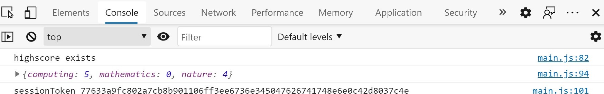
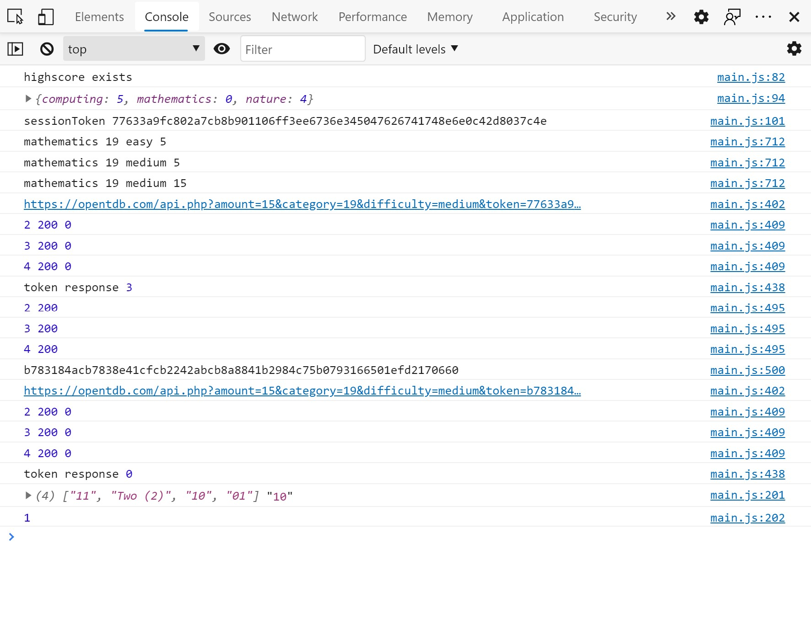

# Functional Tests

## Testing links and responsiveness of each html page:
Using Chrome and Chrome Dev Tools. Check all links open in new tab.

## 1. Common to all pages:

- Test all Links:

Links | index.html | start.html
--- | --- | ---
Owl Icon | y | y
Go! | y | NA
Facebook | y | y
Twitter | y | y
Privacy | y | y

---

## 2. Feedback Form and EmailJs:

- Tested and functioning correctly.
- Displays success and both emails received. 
- Form checked for required on all inputs. 
- Email address input requires valid email form. 
- Send and dismiss buttons working correctly.
- Displays Alert of failure message to the user if there's a problem.

---

## 3. Page Responsiveness:

Breakpoints | index.html | quiz options | quiz answers
--- | --- | --- | ---
W280px | y | y | y
W400px | y | y | y
W576px | y | y | y
W768px | y | y | y
W992px | y | y | y
W1200px | y | y | y
H750px | y | y | y
H1000px | y | y | y

- In addition each page is checked for responsiveness using Chrome Dev Tools infinitely	adjustable 
sliding re-sizer tool. From 280px (Samsung Galaxy Fold) up to full width 1536px on a 4k laptop.
The 404 page not included in the above table was checked this way.
- If the height is less than 1000px the header is hidden during questions.
- If the height is less than 750px the screen scrolls to show the next question button.
- No problems are found.

### __Summary:__

- No problems found.

---

## 4. Bugs List from Github Issues section:

After efforts to "break" the application testing on mobile produced bug #14, which was similar issue
to #12. All bugs below were fixed and explanations can be found in the github issues section of the
repository.

- timer secondsLeft is not displaying the correct value after a question is answered too quickly. A
value from the previous iteration is displayed. #14

- jshint suggested highscore should be accessed via dot notation bug #13

- If answers are answered too quickly it appears the timer has not started bug #12

- Answer button could still be pressed after answer is clicked thereby adding the box-shadow again
bug #11

- After a new high score the high score table is not displaying bug #10 

- Bug when timer counts down and disables answer buttons and exit modal is brought up but 
bug #9 

- When exiting from a quiz answer buttons remain disabled bug #8 

- Bug which allows an answer to be clicked more than once bug #7 

- Wrong answer sound plays at same time as correct answer sound at almost zero seconds remaining 
bug #6 

- Bug Exit Quiz button is still showing at the final question of the quiz bug #5

- Bug where question can still be submitted after timer runs out and answer  as been revealed bug #4 

- Need to obtain token from API before obtaining questions bug #3 

- html encoding of api answers bug #2 

- Issue with Next Question Button bug #1 

---

## 5. List of devices tested:
- Samsung Galaxy S7
- Samsung A21s
- Samsung Galaxy S10
- Huawei P30 Pro
- iPhone 8 Safari through Browserstack
- Asus k501u 4k laptop
- Chrome Dev Tools Device Emulator

---

## 6. Test Cases:
- TC01 - Check options buttons work as intended. When selected should be disabled and box shadow removed.
The 3 options groups should not affect each other. The console log shows the variables are changing when
the button is pressed and are then correctly inserted in the quiz API URL. _Pass_

- TC02 - Check the feedback modal operation. Both notification to admin and acknoledgement to user are 
received.  _Pass_

- TC03 - Load questions and check console log for API URL to match options selected. Confirm if
no contact with API, alert message is displayed to user. Confirm loading spinner is displayed. _Pass_

- TC04 - Confirm if highscore object exists in local storage, it is retrieved and displayed to the user.
Use the console log to confirm. Confirm if it does not exist all scores display as zero. _Pass_

- TC05 - Use the console log to confirm if token exists in session storage, it is used to try to 
retrieve quiz data. If the token (77663a...) is expired response code 3 is logged and a new token obtained and
used (b78318...). Response code 0 means success. _Pass_

- TC06 - Use the console log to confirm if token b78318... is exhausted, response code 4 is received and the token
is reset and reused. Token b78318... receives response code 0. _Pass_

- TC07 - Supply a json object with a mistake to the token and quiz api's to confirm json parse errors
are handled with user alert. _Pass_

- TC08 - Supply different status and response code variables to the api requests to confirm potential 
responses are handled with user alert. _Pass_

- TC09 - Confirm question/answers are displaying and functioning correctly and correct sounds are played
depending on the score outcome and high score is displayed in table after quiz ends. _Pass_

- TC10 - Confirm the multi-use model which is used for feedback, reset-quiz and end-quiz-message all
operate independently without leaving text behind, removing button that is not replaced or otherwise
affecting each other. _Pass_

- TC11 - Confirm pressing buttons repeatedly does not work and that trying to press options buttons 
or answer buttons before fully loaded or displayed does not "break" anything or otherwise cause an 
unexpected outcome. _Pass_

- TC12 - After nature category was renamed to general, highscore table tests were re-run to confirm
functionality. _Pass_

---
