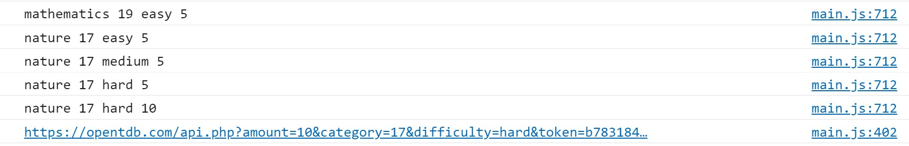
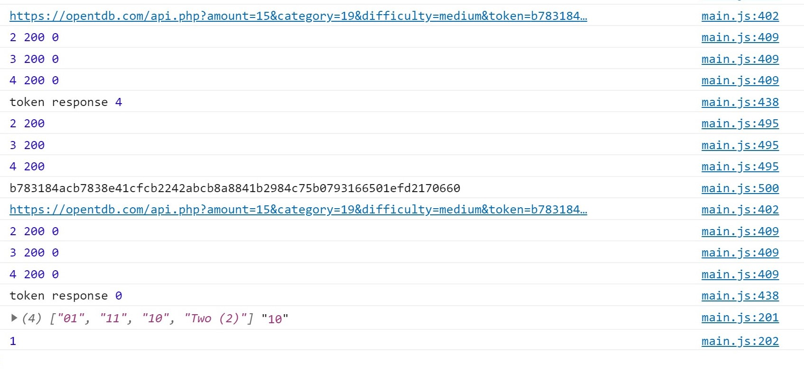

# Functional Tests

## Testing links and responsiveness of each html page:
Using Chrome and Chrome Dev Tools. Check all links open in new tab.

## 1. Common to all pages:

- Test all Links:

Links | index.html | start.html
--- | --- | ---
Owl Icon | y | y
Go! | y | NA
Facebook | y | y
Twitter | y | y
Privacy | y | y

---

## 2. Feedback Form and EmailJs:

- Tested and functioning correctly.
- Displays success and both emails received. 
- Form checked for required on all inputs. 
- Email address input requires valid email form. 
- Send and dismiss buttons working correctly.
- Displays Alert of failure message to the user if there's a problem.

---

## 3. Page Responsiveness:

Breakpoints | index.html | quiz options | quiz answers
--- | --- | --- | ---
W280px | y | y | y
W400px | y | y | y
W576px | y | y | y
W768px | y | y | y
W992px | y | y | y
W1200px | y | y | y
H750px | y | y | y
H1000px | y | y | y

- In addition each page is checked for responsiveness using Chrome Dev Tools infinitely	adjustable 
sliding re-sizer tool. From 280px (Samsung Galaxy Fold) up to full width 1536px on a 4k laptop.
The 404 page not included in the above table was checked this way.
- If the height is less than 1000px the header is hidden during questions.
- If the height is less than 750px the screen scrolls to show the next question button.
- No problems are found.

### __Summary:__

- No problems found.

---

## 4. Bugs List from Github Issues section:

After efforts to "break" the application, testing on mobile produced bug #14, which was a similar issue
to #12. All bugs below were fixed and explanations can be found in the github issues section of the
repository.

- #14 - timer secondsLeft is not displaying the correct value after a question is answered too quickly. A
value from the previous running is displayed. 

    _solution was to reset secondsLeft to the same 
    value as questionTimer every time the timer is run. And to increase the time delay to more than 
    1000ms before answer buttons are enabled. This allows sufficient time for the timer timeInterval
    to do its first iteration._

- #13 - jshint suggested highscore should be accessed via dot notation bug.

    _dot notation did not work properly with edge. Reverted to square bracket notation._

- #12 - If answers are answered too quickly it appears the timer has not started bug.
Then the timer is not cleared and continues to run.

    _This bug was solved by not enabling the buttons until the timer has started.
    There was also a bug observed that if the next question button was pressed too quickly the box
    shadow was removed for the answer buttons for the next question. This problem was solved by
    only enabling the next button at the same time as the box shadow had been removed (or when the
    answer checking process had fully ended)._

- #11 - Answer button could still be pressed after answer is clicked thereby adding the box-shadow again
bug.

    _solved by adding class of no-shadow to answer after answer is clicked._

- #10 - After a new high score the high score table is not displaying bug. 

    _There was an old line of code still there from before the high score table was implemented._

- #9 - Bug when timer counts down and disables answer buttons and exit modal is brought up but 
bug. When next question button is clicked answer buttons stay disabled on following question.

    _Solved by using disable class rather than disabling element when the timer === 0._

- #8 - When exiting from a quiz answer buttons remain disabled bug.

    _Solved by removing disable class when quiz ends._

- #7 - Bug which allows an answer to be clicked more than once.

    _Problem solved by creating a disable class to apply to buttons._

- #6 - Wrong answer sound plays at same time as correct answer sound at almost zero seconds remaining 
bug. 

    _This is due to experimentation with removing the submit button and having select and 
    submit in the same keypress with a built-in time delay. Solve by adjusting the timing of
    sounds and where they are implemented._

- #5 - Bug Exit Quiz button is still showing at the final question of the quiz bug.

    _Code to show this button was in the wrong position. Moved inside the .reset-confirm click function._

- #4 - Bug where question can still be submitted after timer runs out and answer  as been revealed bug.
    
    _Adjusted logic and fixed bug by disabling submit-answer button in displayTimeLeft function when time = 0._

- #3 - Need to obtain token from API before obtaining questions bug.

    _When obtaining questions from the api the token must first be requested and then attached to 
    the questions url. This presents an asynchronous problem. The solution is to have the getToken 
    function return a resolved promise to be used afterwards to download the questions._

- #2 - html encoding of api answers bug. Some answers not being registered correct due to api returning 
html encoded characters.

    _Solution was to put the answers in a custom data attribute of the answer element. So rather than 
    matching the answer presented in the browser (which doesn't show the special characters) to the 
    correct answer, we match to the data attribute._

- #1 - Issue with Next Question Button bug. Causing many more loops than intended.

    _Solution was to add the .off("click") to the click event function to detach the click event.
    The ultimate solution was to remove the nextQuestion function from the askQuestions function.
    The mistake was one was nested inside the other._
---

## 5. List of devices tested:
- Samsung Galaxy S7
- Samsung A21s
- Samsung Galaxy S10
- Huawei P30 Pro
- iPhone 8 Safari through Browserstack
- Asus k501u 4k laptop
- Chrome Dev Tools Device Emulator

---

## 6. Test Cases:
- TC01

    Description: 

    Verify all links on Index page function as expected.

    Procedure: 
    1. Navigate to https://robot5000-design.github.io/ms2-the-science-quiz/index.html
    2. Click on the owl image. Expected Result: Reloads index.html. _Pass_
    3. 

Check options buttons work as intended. When selected should be disabled and box shadow removed.
The 3 options groups should not affect each other. The console log shows the variables are changing when
the button is pressed and are then correctly inserted in the quiz API URL. _Pass_

- TC02 - Check the feedback modal operation. Both notification to admin and acknowledgement to user are 
received.  _Pass_

- TC03 - Load questions and check console log for API URL to match options selected. Confirm if
no contact with API, alert message is displayed to user. Confirm loading spinner is displayed. _Pass_

- TC04 - Confirm if highscore object exists in local storage, it is retrieved and displayed to the user.
Use the console log to confirm. Confirm if it does not exist all scores display as zero. _Pass_

- TC05 - Use the console log to confirm if a token exists in session storage, it is used to try to 
retrieve quiz data. If the token (example below 77663a...) is expired response code 3 is logged and a new
token obtained and used (example below b78318...). Response code 0 means success. _Pass_

- TC06 - Use the console log to confirm if token (example below b78318...) is exhausted, response code 4 is 
received and the token is reset and reused. Same Token (b78318... below) receives response code 0. _Pass_

- TC07 - Supply a fabricated json object (with an error built-in) to the token and quiz api's to confirm 
json parse errors are handled with a user alert. _Pass_

- TC08 - Supply different fabricated status and response code variables to the api requests to confirm
potential responses are handled with user alert. _Pass_

- TC09 - Confirm question/answers are displaying and functioning correctly and correct sounds are played
depending on the score outcome and high score value is displayed in updated table after quiz ends. _Pass_

- TC10 - Confirm the multi-use modal which is used for feedback, reset-quiz and end-quiz-message all
operate independently without leaving text behind, or removing a button that is not replaced or otherwise
affecting each other. _Pass_

- TC11 - Confirm pressing buttons repeatedly does not work and that trying to press options buttons 
or answer buttons before fully loaded or displayed does not "break" anything or otherwise cause an 
unexpected outcome. _Pass_

- TC12 - After nature category was renamed to general, highscore table tests were re-run to confirm
functionality. _Pass_

---
